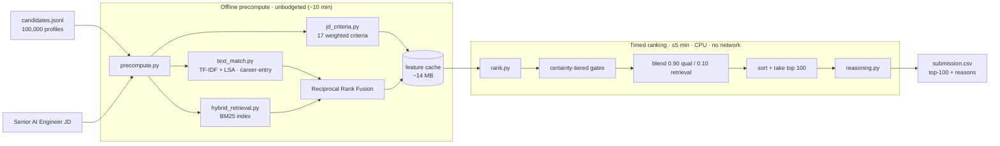
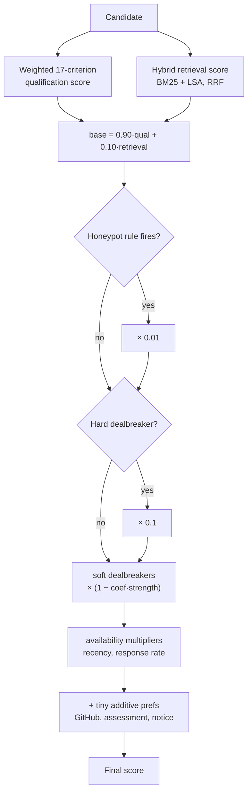

# Redrob Ranker

**Rank the 100 best-fit candidates out of 100,000 for a hard-to-fill AI role — the way a great recruiter would, not by matching keywords.**


Built for the **India Runs Hackathon 2026 — The Data & AI Challenge (Track 1)**. Given a fixed job
description (*Senior AI Engineer — Founding Team*) and a pool of 100,000 synthetic candidate profiles
(`candidates.jsonl`), the system ranks the top 100 best-fit candidates and emits a spec-compliant CSV,
each row carrying a short, evidence-grounded reason.

> **Design philosophy.** A deterministic, EDA-calibrated, certainty-gated scoring system where every
> weight traces back to a sentence in the JD (defensible live at the Stage-5 interview). All heavy work
> is precomputed offline; the timed ranking step is pure cache-load plus vectorized arithmetic.

---

## Problem Statement

The dataset is adversarial by design. Redrob planted a trap the organizers describe explicitly:
thousands of profiles staple trendy AI keywords onto unrelated careers.

Measured on the real pool:

| Reality of the pool | Value |
|---|---|
| Candidates holding a **genuine AI/ML job title** | **531 (0.53%)** |
| Candidates in **keyword-trap professions** (Marketing Manager, Accountant, …) | **68,821 (68.8%)** |
| Planted **honeypots** with subtly impossible profiles | ~80 |

A naive ranker — keyword search *or* dense embedding similarity — rewards exactly these decoys, because
a padded skills list scores high on surface similarity. **The right answer requires reasoning about the
gap between what a profile *says* and what a career actually *proves*.**

## Our Solution

Judge each candidate on **the jobs they actually held, entry by entry — never on their skills list.**
A padded keyword bag cannot fake work you never did, so the trap that defeats keyword search and dense
embeddings does not defeat us. Concretely, three ideas do the heavy lifting:

1. **Career-entry retrieval, not whole-profile embedding.** We match the JD against *individual career
   entries* and keep the strongest evidence per requirement, so a real accomplishment surfaces even if
   it is buried in one old role, and a long skills list cannot inflate a thin career.
2. **Certainty-tiered gating.** Penalty is matched to confidence: impossible profiles are pushed out
   hard (×0.01), the JD's named dealbreakers cut sharply (×0.1), and soft concerns only nudge. One
   blunt cutoff would sink honest, sparse candidates; graded gates do not.
3. **Objective corroboration.** Where Redrob's own per-skill assessment scores exist, we trust the test
   over the claim — a candidate who claims *expert* but scores under 40 is down-weighted.

Everything is **deterministic and fully offline**, and every ranked candidate ships with a reason built
only from its own fields.

## Key Features

- **Two-lane hybrid retrieval** — lexical (BM25) fused with semantic (TF-IDF + LSA) via Reciprocal Rank
  Fusion, so neither lane's blind spot decides the shortlist alone.
- **17-criterion JD checklist** — 4 must-haves, 5 nice-to-haves, and the JD's named dealbreakers, each
  carrying the verbatim JD sentence that justifies its weight.
- **EDA-verified honeypot detection** — two hard rules with clean statistical separation in the real
  data, applied as a near-zero multiplier.
- **Corpus-anchored recency** — "recently active" is measured against the dataset's own timeline
  (`max(last_active_date)`), never the wall clock. See [Design Decisions](#design-decisions).
- **Non-hallucinating explanations** — reasons are assembled from atomic profile facts; a skill or
  employer not in the profile can never appear in the text.
- **Hard-constraint compliant** — ~19 s CPU-only ranking, no network, 14 MB cache. Verified by
  [`src/compliance_check.py`](src/compliance_check.py).
- **Hosted sandbox** — a one-file [Streamlit app](app.py) runs the full pipeline on a small sample.

---

## Architecture Overview

Heavy computation happens once, offline. The timed step only loads a cache and does arithmetic.



### Ranking Pipeline (how a single score is formed)



### Module Responsibilities

| Module | Responsibility |
|---|---|
| [`src/jd_criteria.py`](src/jd_criteria.py) | The 17-criterion checklist; each criterion holds the JD sentence justifying its weight. |
| [`src/jd_text.py`](src/jd_text.py), [`src/aliases.py`](src/aliases.py) | JD text assembly and skill/term synonym expansion. |
| [`src/text_match.py`](src/text_match.py) | TF-IDF + TruncatedSVD (LSA), matched at the career-entry level with max-evidence per criterion. |
| [`src/hybrid_retrieval.py`](src/hybrid_retrieval.py) | BM25 lexical lane fused with the semantic lane via Reciprocal Rank Fusion; rank-percentile normalization. |
| [`src/features.py`](src/features.py) | Structural facts from dates/numbers/enums (experience fit, availability, GitHub/assessment corroboration) + structural dealbreakers. |
| [`src/honeypots.py`](src/honeypots.py) | Two EDA-verified impossibility rules + the skill-assessment overclaim coherence signal. |
| [`src/reasoning.py`](src/reasoning.py) | Fragment-pool reasoning: atomic facts extracted from real fields, varied per candidate, never free-generated. |
| [`src/precompute.py`](src/precompute.py) | Offline: builds the criteria, indexes, and feature cache. |
| [`src/rank.py`](src/rank.py) | Timed: loads cache, applies the blend and gates, sorts, writes the CSV. |
| [`src/compliance_check.py`](src/compliance_check.py) | Proves no-network / no-GPU / disk-budget compliance. |
| [`src/config.py`](src/config.py) | All coefficients, each annotated with its provenance (JD-verbatim, EDA-verified, or bounded judgment). |

---

## Technology Stack

Deliberately minimal and reproduction-safe. **No PyTorch, no transformers** — dense embeddings were
tested and measured to *hurt* on this pool (they reward the very keyword-stuffers the JD warns about),
so they were rejected on evidence. See [Design Decisions](#design-decisions).

| Layer | Technology | Why |
|---|---|---|
| Semantic retrieval | scikit-learn (TF-IDF + TruncatedSVD/LSA) | Deterministic, CPU-only, no model weights to ship or drift. |
| Lexical retrieval | rank-bm25 | Proven, transparent matching for exact tools and terms. |
| Fusion | Reciprocal Rank Fusion (in-repo) | Combines lanes by rank, avoiding score-scale mixing. |
| Numerics | NumPy, SciPy | Vectorized float32 scoring — the timed step is arithmetic, not a model call per candidate. |
| Config / IO | PyYAML, Python stdlib | Pinned, minimal footprint. |
| Sandbox demo | Streamlit | Hosted reviewer demo; **not** imported by the ranker. |
| Tests | Python stdlib `unittest` | No extra dependencies. |

All versions are pinned in [`requirements.txt`](requirements.txt).

## Repository Structure

```
redrob-ranker/
├── src/
│   ├── config.py            # provenance-annotated coefficients
│   ├── io_utils.py          # candidate parsing, safe field access
│   ├── jd_criteria.py       # 17-criterion JD checklist
│   ├── jd_text.py, aliases.py
│   ├── text_match.py        # TF-IDF + LSA (career-entry, max-evidence)
│   ├── hybrid_retrieval.py  # BM25 + Reciprocal Rank Fusion
│   ├── features.py          # structural facts + dealbreakers
│   ├── honeypots.py         # EDA-verified impossibility rules
│   ├── reasoning.py         # fragment-pool, non-hallucinating reasons
│   ├── precompute.py        # OFFLINE stage (unbudgeted)
│   ├── rank.py              # TIMED stage (≤5 min, CPU, no network)
│   └── compliance_check.py  # no-network / no-GPU / disk proof
├── eval/                    # metrics.py, evaluate.py, score_vs_gt.py, blind judge label sets
├── tests/                   # test_ranker.py (stdlib unittest)
├── notebooks/               # calibration + evaluation-strategy write-ups (evidence)
├── docs/BRIEFING.md
├── app.py                   # Streamlit sandbox (spec §10.5)
├── requirements.txt         # pinned dependencies
└── submission_metadata.yaml # portal metadata
```

`cache/` (produced by `precompute.py`) and all test data are gitignored.

---

## Installation

```bash
git clone https://github.com/saanviv812/redrob_indiaruns_stardustteam.git
cd redrob_indiaruns_stardustteam
python -m venv .venv && source .venv/bin/activate    # Windows: .venv\Scripts\activate
pip install -r requirements.txt
```

Requires **Python 3.11**, CPU-only, ≤16 GB RAM. No GPU, no network access needed at any point.

## Running Locally

```bash
# 1. Precompute — offline, ~10 min, UNBUDGETED (builds cache/ from the candidate file).
python src/precompute.py --candidates /path/to/candidates.jsonl

# 2. Rank — the BUDGETED Stage-3 step: <5 min, <16 GB, CPU-only, no network. Produces the CSV.
python src/rank.py --candidates /path/to/candidates.jsonl --out submission.csv
```

The single Stage-3 reproduction command is **step 2** (`rank.py`); step 1 is the documented
pre-computation that may exceed the 5-minute window (spec §10.3). Both run CPU-only and offline.

### Configuration

All tunable behavior lives in [`src/config.py`](src/config.py) — retrieval/qualification blend
(`0.90 / 0.10`), gate multipliers (honeypot `0.01`, hard dealbreaker `0.1`), soft-dealbreaker
coefficient, and additive-preference caps. Every value is annotated with its provenance so it is
defensible in review. The cache directory can be overridden with the `REDROB_CACHE_DIR` env var.

---

## Measured Results (real 100K pool)

| Metric | Result |
|---|---|
| `precompute.py` wall-clock | ~577 s (offline, unbudgeted) |
| **`rank.py` wall-clock** | **~19 s** (scoring ~0.5 s; the rest is one file re-stream for reasoning) |
| Peak memory (`rank.py`) | well under 16 GB (cache 14 MB, arrays float32) |
| Cache disk footprint | **0.014 GB** (budget 5 GB) |
| `validate_submission.py` | **PASS** |
| Honeypots in top-100 (our two EDA rules) | **0** (auto-DQ if >10) |
| Trap-profession titles in top-100 | **0** |
| Compliance (`src/compliance_check.py`) | **COMPLIANT** — no network, no GPU, disk OK |

## Evaluation

```bash
python eval/evaluate.py --candidates /path/to/candidates.jsonl
python -m unittest discover -s tests -v      # unit tests
python src/compliance_check.py               # no-network / no-GPU / disk proof
```

**Honest caveat (important).** There is **no ground truth available to us** — the hidden relevance
labels are revealed only after submissions close, and the competition has no public leaderboard. Every
relevance label we use is therefore our own *inference*. We validated the ranker against a blind,
JD-faithful LLM-as-judge over stratified samples (and corrected a sampling bias we found in our own
evaluation), but we treat those numbers as an **internal development signal, not proof of correctness** —
the same author built and judged the model, so the agreement is partly circular. The trustworthy signal
is the *negative* class: honeypots and keyword-stuffers are defined by the spec, not by us, and our
ranker excludes them cleanly. Full methodology and its limitations are in
[`notebooks/eval_strategy.md`](notebooks/eval_strategy.md).

## Sandbox Demo

A one-file Streamlit app ([`app.py`](app.py)): upload a ≤100-candidate JSONL sample → the **full
pipeline** (offline precompute + CPU-only, no-network ranking) runs → the ranked candidates, their
reasons, and a downloadable CSV are shown. Runs in ~1–2 s on a small sample.

```bash
streamlit run app.py
```

Hosted link (required by spec §10.5): **https://redrobindiarunsstardustteam.streamlit.app**

> `streamlit` is listed separately in `requirements.txt` and is **not** imported by the ranker — the
> Stage-3 reproduction of `rank.py` needs only the ranking-pipeline dependency block.

---

## Design Decisions

Every non-obvious choice was made against the *real data*, not copied from a textbook.

| Decision | Why (evidence in repo / data) |
|---|---|
| **TF-IDF + LSA over dense embeddings** | We embedded all 100K profiles with a sentence-transformer and measured it *losing* to the lighter hybrid — dense vectors reward the keyword-stuffers the JD planted, and add ~1.3 GB of reproduction risk. Rejected on evidence. |
| **Career-entry matching, not whole-profile** | A padded skills list cannot inflate a thin career when evidence is scored per job held. |
| **Certainty-tiered gates** | Match penalty to confidence; a single blunt cutoff would wrongly sink honest, sparse candidates. |
| **Directional honeypot rule** | Flags careers claiming *more* months than the person has, but never the honest engineer who *under-lists* — a symmetric rule false-flagged real candidates. |
| **Corpus-anchored recency** | Anchoring "recently active" to `max(last_active_date)` instead of the wall clock; using `datetime.now()` would falsely mark ~30% of the pool inactive and make results drift across run dates. |
| **Skill-assessment overclaim signal** | 33.7% of assessed candidates claim advanced/expert yet score <40 on Redrob's own test — an objective coherence check most pipelines miss. |
| **Refused three tempting fraud signals** | Salary min>max (noise in 19% of profiles), duplicate summaries (a generation artifact), and company-founding dates (unbuildable — only 63 distinct company names) would each have wrecked thousands of legitimate candidates. |

Full rationale: [`../UPDATED_ARCHITECTURE.md`](../UPDATED_ARCHITECTURE.md); calibration evidence:
[`notebooks/honeypot_calibration.md`](notebooks/honeypot_calibration.md),
[`notebooks/dealbreaker_feature_calibration.md`](notebooks/dealbreaker_feature_calibration.md).

## Future Work

- Independent, human-labeled validation set to remove the shared-author bias in the current evaluation.
- Learning-to-rank layer over the current features once ground-truth-quality labels exist.
- Broader synonym/alias coverage for adjacent-domain career narratives.

## AI Tool Usage

Built with Claude's assistance (architecture discussion, exploratory data analysis against the real
100K pool, and code authoring/review), declared honestly in
[`submission_metadata.yaml`](submission_metadata.yaml). **No candidate data was sent to any hosted
LLM, and the ranking step makes zero network calls.**

## Team — Stardust

| Member | Role |
|---|---|
| Neha Shetty | Team Lead & ML Engineer |
| Saanvi Varma | Ranking / Retrieval Engineer |
| Hamsini | Data Scientist (EDA & Evaluation) |

## Acknowledgements

Redrob AI and Hack2skill for the **India Runs Hackathon 2026** and the well-designed, trap-aware
dataset. Built on the open-source scientific Python stack (scikit-learn, rank-bm25, NumPy, SciPy).

---

© 2026 Team Stardust. Submitted for the India Runs Hackathon 2026 — Data & AI Challenge (Track 1).
