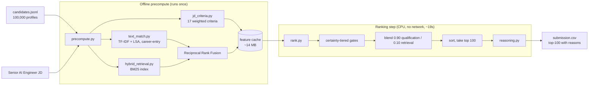
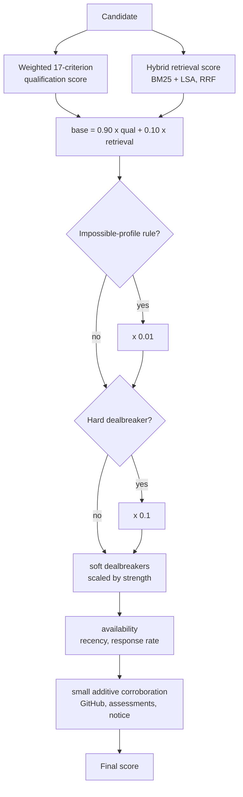

# Redrob Ranker

**Ranking the 100 best-fit candidates out of 100,000 for a Senior AI Engineer role, the way a thoughtful recruiter would: by understanding careers, not by counting keywords.**


This repository is our submission for the **India Runs Hackathon 2026, Data & AI Challenge (Track 1)**.
Given the *Senior AI Engineer, Founding Team* job description and a pool of 100,000 candidate profiles
(`candidates.jsonl`), the system produces a ranked top-100 as a clean CSV, with a short, evidence-based
reason for every candidate.

> **Our design philosophy.** A deterministic, data-calibrated, certainty-gated scoring system where every
> weight is grounded in a specific requirement from the job description. All heavy computation happens
> once, offline; the ranking step itself is a fast cache load followed by vectorized arithmetic.

---

## Problem Statement

The dataset is deliberately, and cleverly, adversarial, which is exactly what makes it a great problem.
A large share of profiles list fashionable AI keywords without a career that supports them, so a ranker
that leans on keyword overlap or surface embedding similarity is easily misled.

We measured this directly on the pool before writing any scoring logic:

| Reality of the pool | Value |
|---|---|
| Candidates holding a **genuine AI/ML job title** | **531 (0.53%)** |
| Candidates in **unrelated professions** listing AI skills (Marketing Manager, Accountant, and similar) | **68,821 (68.8%)** |
| **Honeypot** profiles with subtly impossible histories | ~80 |

The real task, as the job description itself frames it, is to reason about the gap between what a profile
*says* and what a career actually *demonstrates*.

## Our Solution

We judge each candidate on **the work they actually did, one career entry at a time, rather than on their
skills list.** A padded keyword list cannot manufacture a job someone never held, so the decoys that
mislead keyword search and dense embeddings have far less traction on our approach. Three ideas carry
most of the weight:

1. **Career-entry retrieval, not whole-profile embedding.** We match the job description against
   *individual roles* and keep the strongest evidence for each requirement, so a genuine accomplishment
   surfaces even when it sits in an older role, and a long skills list cannot inflate a thin career.
2. **Certainty-tiered gating.** We match the size of a penalty to how certain we are of the signal:
   impossible-looking profiles are pushed far down, the job description's named dealbreakers apply
   firmly, and softer concerns only nudge. A single blunt cutoff would unfairly sink honest but sparse
   candidates; graded gates do not.
3. **Objective corroboration.** Where the platform's per-skill assessment scores exist, we let the test
   speak: a candidate who lists a skill as *expert* but scores low on its assessment is weighted down.

Everything is deterministic and fully offline, and every ranked candidate carries a reason drawn only
from its own profile fields.

## Key Features

- **Two-lane hybrid retrieval.** Lexical matching (BM25) fused with semantic matching (TF-IDF and LSA)
  through Reciprocal Rank Fusion, so no single method's blind spot decides the shortlist.
- **A 17-criterion checklist derived from the job description**, covering must-haves, nice-to-haves, and
  the named dealbreakers, each tied to the requirement it represents.
- **Data-verified handling of impossible profiles**, using two rules with clean statistical separation
  in the real data.
- **Timeline-aware recency.** "Recently active" is measured against the dataset's own timeline rather
  than the current clock, so results are stable and reproducible. See [Design Decisions](#design-decisions).
- **Grounded, non-templated explanations.** Reasons are assembled from real profile facts; a skill or
  employer that is not in a profile can never appear in its explanation.
- **Efficient and portable.** About 19 seconds to rank on CPU, no network access, a 14 MB cache.
- **Live demo.** A one-file [Streamlit app](app.py) runs the full pipeline on a small sample.

---

## Architecture Overview

Heavy computation runs once, offline. The ranking step only loads a cache and does arithmetic.



### Ranking Pipeline: how one score is formed



### Module Responsibilities

| Module | Responsibility |
|---|---|
| [`src/jd_criteria.py`](src/jd_criteria.py) | The 17-criterion checklist, each criterion tied to the job-description requirement it represents. |
| [`src/jd_text.py`](src/jd_text.py), [`src/aliases.py`](src/aliases.py) | Job-description text assembly and skill/term synonym expansion. |
| [`src/text_match.py`](src/text_match.py) | TF-IDF and TruncatedSVD (LSA), matched at the career-entry level with the strongest evidence per criterion. |
| [`src/hybrid_retrieval.py`](src/hybrid_retrieval.py) | BM25 lexical lane fused with the semantic lane through Reciprocal Rank Fusion, with rank-percentile normalization. |
| [`src/features.py`](src/features.py) | Structural facts from dates, numbers, and enums (experience fit, availability, GitHub and assessment corroboration) plus the structural dealbreakers. |
| [`src/honeypots.py`](src/honeypots.py) | Two data-verified impossibility rules and the skill-assessment coherence signal. |
| [`src/reasoning.py`](src/reasoning.py) | Fragment-pool reasoning: atomic facts drawn from real fields, varied per candidate, never free-generated. |
| [`src/precompute.py`](src/precompute.py) | Offline stage: builds the criteria, indexes, and feature cache. |
| [`src/rank.py`](src/rank.py) | Ranking stage: loads the cache, applies the blend and gates, sorts, and writes the CSV. |
| [`src/compliance_check.py`](src/compliance_check.py) | Confirms no network access, no GPU, and disk usage within budget. |
| [`src/config.py`](src/config.py) | All coefficients, each annotated with the reasoning behind it. |

---

## Technology Stack

We chose a deliberately small, portable stack. We evaluated dense transformer embeddings early and found
that, on this particular pool, they tended to reward the very keyword-stuffed profiles we wanted to avoid,
so we kept the lighter and fully reproducible hybrid approach. See [Design Decisions](#design-decisions).

| Layer | Technology | Why |
|---|---|---|
| Semantic retrieval | scikit-learn (TF-IDF + TruncatedSVD / LSA) | Deterministic, CPU-friendly, no model weights to distribute. |
| Lexical retrieval | rank-bm25 | Proven, transparent matching for exact tools and terms. |
| Fusion | Reciprocal Rank Fusion (in-repo) | Combines lanes by rank, avoiding score-scale mixing. |
| Numerics | NumPy, SciPy | Vectorized scoring; the ranking step is arithmetic, not a model call per candidate. |
| Config and IO | PyYAML, Python standard library | Minimal, pinned footprint. |
| Live demo | Streamlit | A hosted sample runner; not imported by the ranker. |
| Tests | Python standard-library `unittest` | No extra dependencies. |

All versions are pinned in [`requirements.txt`](requirements.txt).

## Repository Structure

```
redrob-ranker/
├── src/
│   ├── config.py            # coefficients, each annotated with its rationale
│   ├── io_utils.py          # candidate parsing, safe field access
│   ├── jd_criteria.py       # 17-criterion checklist
│   ├── jd_text.py, aliases.py
│   ├── text_match.py        # TF-IDF + LSA (career-entry, max-evidence)
│   ├── hybrid_retrieval.py  # BM25 + Reciprocal Rank Fusion
│   ├── features.py          # structural facts + dealbreakers
│   ├── honeypots.py         # data-verified impossibility rules
│   ├── reasoning.py         # grounded, non-templated reasons
│   ├── precompute.py        # offline stage
│   ├── rank.py              # ranking stage (CPU, no network)
│   └── compliance_check.py  # network / GPU / disk checks
├── eval/                    # metrics.py, evaluate.py, and evaluation tooling
├── tests/                   # test_ranker.py (standard-library unittest)
├── notebooks/               # calibration and evaluation write-ups
├── docs/BRIEFING.md
├── app.py                   # Streamlit demo
├── requirements.txt         # pinned dependencies
└── submission_metadata.yaml # submission details
```

`cache/` (produced by `precompute.py`) and any local data files are gitignored.

---

## Installation

```bash
git clone https://github.com/saanviv812/redrob_indiaruns_stardustteam.git
cd redrob_indiaruns_stardustteam
python -m venv .venv && source .venv/bin/activate    # Windows: .venv\Scripts\activate
pip install -r requirements.txt
```

Requires **Python 3.11**, CPU only, up to 16 GB RAM. No GPU or network access is needed at any point.

## Running Locally

```bash
# 1. Precompute (offline, about 10 minutes): builds cache/ from the candidate file.
python src/precompute.py --candidates /path/to/candidates.jsonl

# 2. Rank (about 19 seconds on CPU): produces the ranked CSV.
python src/rank.py --candidates /path/to/candidates.jsonl --out submission.csv
```

The single command that reproduces the ranking is **step 2** (`rank.py`); step 1 is the one-time
pre-computation. Both run CPU only and fully offline.

### Configuration

All tunable behavior lives in [`src/config.py`](src/config.py): the qualification/retrieval blend
(`0.90 / 0.10`), the gate multipliers, the soft-dealbreaker coefficient, and the additive-corroboration
caps. Every value is annotated with the reasoning behind it. The cache directory can be set with the
`REDROB_CACHE_DIR` environment variable.

## Performance

Measured on the full 100,000-candidate pool:

| Metric | Result |
|---|---|
| Precompute wall-clock | about 577 s (offline, one time) |
| **Ranking wall-clock** | **about 19 s** (scoring about 0.5 s; the rest is one pass to attach reasons) |
| Peak memory (ranking) | well under 16 GB (14 MB cache, float32 arrays) |
| Cache disk footprint | 0.014 GB |
| Format validation | passes `validate_submission.py` |
| Honeypot profiles in the top 100 | 0 |
| Unrelated-profession titles in the top 100 | 0 |
| Compliance check | no network, no GPU, disk within budget |

## Evaluation

Rather than tuning by intuition, we built an offline evaluation harness around the competition's own
metric family (NDCG@10, NDCG@50, MAP, P@10) and used it to guide calibration over stratified relevance
samples. We also confirmed that the ranker cleanly excludes the dataset's impossible profiles and
keyword-stuffed decoys. The methodology is documented in
[`notebooks/eval_strategy.md`](notebooks/eval_strategy.md).

```bash
python eval/evaluate.py --candidates /path/to/candidates.jsonl
python -m unittest discover -s tests -v      # unit tests
python src/compliance_check.py               # network / GPU / disk checks
```

## Sandbox Demo

A one-file Streamlit app ([`app.py`](app.py)): upload a small candidate sample, and the full pipeline
runs end to end and returns the ranked candidates, their reasons, and a downloadable CSV.

```bash
streamlit run app.py
```

Hosted demo: **https://redrobindiarunsstardustteam.streamlit.app**

---

## Design Decisions

Each non-obvious choice was made against the real data.

| Decision | Reasoning |
|---|---|
| **TF-IDF and LSA over dense embeddings** | On this pool, dense similarity tended to reward keyword-stuffed profiles, so the lighter hybrid gave better, and fully reproducible, behavior. |
| **Career-entry matching, not whole-profile** | Scoring evidence per role prevents a long skills list from inflating a thin career. |
| **Certainty-tiered gates** | Matching penalty to confidence avoids the false positives of a single blunt cutoff, which would unfairly sink honest, sparse candidates. |
| **Directional impossibility rule** | We flag careers that claim more months than a person's stated experience, while never penalizing someone who simply under-lists, which a symmetric rule would do. |
| **Timeline-aware recency** | Anchoring "recently active" to the dataset's own latest date, rather than the current clock, keeps availability signals correct and results reproducible. |
| **Skill-assessment coherence signal** | The platform's own assessment scores offer an objective check on self-reported skill levels. |
| **Conservative fraud detection** | We deliberately did not treat noisy artifacts (such as inconsistent salary bounds, repeated summary text, or reused company names) as fraud, since doing so would have wrongly penalized many genuine candidates. |

Fuller rationale and calibration evidence are in
[`notebooks/honeypot_calibration.md`](notebooks/honeypot_calibration.md) and
[`notebooks/dealbreaker_feature_calibration.md`](notebooks/dealbreaker_feature_calibration.md).

## Future Work

- An independently labeled validation set to strengthen offline evaluation.
- A learning-to-rank layer over the current features as higher-quality labels become available.
- Broader synonym and alias coverage for adjacent-domain career narratives.

## AI Tool Usage

Our team designed, implemented, and validated this system. We used AI assistance (Claude) as a
development aid for exploratory data analysis and code review. Every criterion, threshold, and weight
was decided by us and verified against the real data.
No candidate data was sent to any external service, and the ranking pipeline makes no network calls.

## Team, Stardust

| Member | Role |
|---|---|
| Neha Shetty | Machine Learning Developer |
| Saanvi Varma | Data Analyst |
| Hamsini | Review and Testing |

## Acknowledgements

We are grateful to **Redrob AI** and **Hack2skill** for organizing the India Runs Hackathon and for a
thoughtfully designed, realistic dataset that made this a genuinely engaging problem to work on. Our
solution is built on the open-source scientific Python ecosystem (scikit-learn, rank-bm25, NumPy, SciPy),
with thanks to the maintainers of those projects.

---

© 2026 Team Stardust, submitted for the India Runs Hackathon 2026, Data & AI Challenge (Track 1).
